# EnforceCore — Technical Architecture

## Design Philosophy

EnforceCore is designed around one core idea: **enforcement at the call boundary**.

Every time an agent system makes an external call — invoking a tool, hitting an API, reading a file, opening a network connection, spawning a process — that call passes through an enforcement point. At that point, policies are evaluated, data is redacted, resources are constrained, and an audit entry is recorded.

This is fundamentally different from:
- **Prompt-level guardrails** — which operate inside the LLM and can be bypassed
- **Output filters** — which operate after the damage is already done
- **Network firewalls** — which operate at the wrong granularity for agent tool calls

## High-Level Architecture


## Core Components

### Enforcement Data Flow

The following diagram shows the complete flow of an enforced tool call,
including threat boundaries:


### 1. Enforcer (Coordinator)

The central orchestrator. It intercepts external calls, coordinates all protection components, and makes the allow/block/redact decision.

**Responsibilities:**
- Provide the `@enforce()` decorator and `enforce()` async context manager
- Coordinate the execution pipeline (pre-call → execute → post-call)
- Handle both sync and async call patterns
- Aggregate decisions from all components
- Raise `EnforcementViolation` on policy breach

**Critical design decision — Async-first:**
Modern agent frameworks (LangGraph, AutoGen, etc.) are async-first. EnforceCore MUST support both sync and async from day one. The `Enforcer` internally runs async and provides sync wrappers.

```python
# Both patterns work
@enforce(policy="policy.yaml")
def sync_tool(args):
    ...

@enforce(policy="policy.yaml")
async def async_tool(args):
    ...
```

### 2. Policy Engine

Loads, validates, and evaluates declarative policies. Policies define what is allowed, denied, and how violations should be handled.

**Responsibilities:**
- Load policies from YAML files or Python objects
- Validate policies against a Pydantic schema
- Evaluate pre-call conditions (before execution)
- Evaluate post-call conditions (after execution)
- Support policy composition (inherit, override, merge)

**Policy structure (YAML):**
```yaml
name: "default-agent-policy"
version: "1.0"

rules:
  allowed_tools:
    - "web_search"
    - "read_file"
    - "calculator"

  denied_tools:
    - "execute_shell"
    - "send_email"

  pii_redaction:
    enabled: true
    categories:
      - email
      - phone
      - ssn
      - credit_card
      - ip_address
      - person_name

  resource_limits:
    max_call_duration_seconds: 30
    max_memory_mb: 256
    max_cost_usd: 1.00

  network:
    allowed_domains:
      - "api.openai.com"
      - "*.wikipedia.org"
    deny_all_other: true

  post_call:
    max_output_size_bytes: 1048576  # 1MB
    redact_output: true

on_violation: "block"  # block | log | redact
```

**Design note:** Policies are Pydantic models internally, giving us validation, serialization, and IDE autocompletion for free.

### 3. Redactor

Real-time PII and sensitive data redaction on both inputs and outputs of enforced calls.

**Responsibilities:**
- Detect PII in text (emails, phone numbers, SSNs, credit cards, IP addresses, names)
- Redact detected PII before the call (input protection)
- Redact detected PII in the response (output protection)
- Support configurable redaction strategies (mask, hash, remove, placeholder)
- Log redaction events for audit

**Implementation:**
Uses a pure regex-based detection engine with 5 compiled PII category patterns. Designed for zero external dependencies and sub-millisecond overhead.

**Performance (benchmarked):**
Regex-based redaction is extremely fast:
- Policy evaluation: ~0.01ms
- PII redaction (short input): ~0.028ms
- PII redaction (~2KB input): ~0.129ms
- Audit entry creation: ~0.01ms
- Full E2E overhead: ~0.056ms

**Total realistic overhead: < 1ms** — negligible compared to typical tool call latency (100ms-10s).

### 4. Auditor (Merkle)

Produces tamper-proof, cryptographically verifiable audit trails for every enforced call.

**Responsibilities:**
- Generate a signed audit entry for every enforced call (inputs, outputs, policy, decision, timing)
- Chain entries using a Merkle tree (each entry includes the hash of the previous)
- Support verification (prove no entries were modified or deleted)
- Write to JSONL files (v1.0) with pluggable storage backends later

**Audit entry structure:**
```json
{
  "id": "uuid-v4",
  "timestamp": "2026-02-20T10:30:00Z",
  "call": {
    "tool": "web_search",
    "args_hash": "sha256:abc...",
    "result_hash": "sha256:def..."
  },
  "policy": {
    "name": "default-agent-policy",
    "version": "1.0",
    "decision": "allowed"
  },
  "redaction": {
    "input_redactions": 2,
    "output_redactions": 0
  },
  "timing": {
    "enforcement_overhead_ms": 12.3,
    "call_duration_ms": 450.1
  },
  "merkle": {
    "entry_hash": "sha256:ghi...",
    "previous_hash": "sha256:jkl...",
    "tree_root": "sha256:mno..."
  }
}
```

### 5. Guard (Resource + KillSwitch)

Constrains the resources available to a tool call and provides hard termination on violations.

**Responsibilities:**
- Enforce time limits (call duration)
- Enforce memory limits
- Enforce cost limits (cumulative across calls)
- Hard kill on limit breach (signal-based termination)

**⚠️ Critical architecture decision — Cross-platform strategy:**

The original conversation proposed seccomp-bpf and cgroups v2 as core components. **This is problematic because these are Linux-only.**

Most researchers and developers work on macOS (and some on Windows). If the Guard component only works on Linux, adoption will be severely limited.

**Our approach for v1.0:**

| Capability | Linux | macOS | Windows |
|---|---|---|---|
| Time limits | `signal.alarm` + thread timeout | `signal.alarm` + thread timeout | Thread timeout |
| Memory limits | cgroups v2 (if available) | `resource.setrlimit` | Process monitoring |
| CPU limits | cgroups v2 (if available) | `resource.setrlimit` | Process monitoring |
| Syscall filtering | seccomp-bpf (optional extra) | N/A (logged warning) | N/A (logged warning) |
| Process isolation | Optional (via subprocess) | Optional (via subprocess) | Optional (via subprocess) |

**Design:** The Guard uses a `Platform` abstraction that auto-detects the OS and applies the strongest available constraints. On Linux with root/cgroup access, you get the full hardened sandbox. On macOS, you get time/memory limits via POSIX signals. On any platform, you always get the Enforcer + Policy + Redactor + Auditor — the security-critical parts.

Advanced Linux hardening (seccomp, cgroups) is available as an optional `enforcecore[linux]` extra.

### 6. Integration Layer

Provides clean adapters for popular agent frameworks.

**Design:** The integration layer is NOT a hard dependency. It provides thin adapter patterns that translate framework-specific tool call mechanisms into EnforceCore's enforcement API.

**Supported in v1.0.x:**
- **Plain Python** — `@enforce()` decorator on any function
- **LangGraph** — Custom tool wrapper
- **CrewAI** — Tool decorator adapter
- **AutoGen** — Function registration wrapper

Each adapter is ~20-50 lines of code. The examples directory provides copy-paste-ready integration patterns.

## Module Dependency Graph


## Error Handling Strategy

EnforceCore uses a clear exception hierarchy:


**Key principle:** Enforcement failures should **always fail closed** (block the call), never fail open (let it through). If the Policy Engine crashes, the call is blocked. If the Redactor fails, the call is blocked. Safety by default.

## Thread Safety & Concurrency

- The `PolicyEngine` is thread-safe (policies are immutable after loading)
- The `Enforcer` supports concurrent async calls (no shared mutable state per call)
- The `Auditor` uses a thread-safe append-only log with file locking
- The `Guard` resource tracking is per-call, not global (except cumulative cost, which uses an atomic counter)

## Performance Targets (Benchmarked)

| Component | Measured | Notes |
|---|---|---|
| Policy evaluation | < 0.1ms | Pydantic model validation + rule matching |
| PII redaction (short input) | ~0.028ms | Compiled regex patterns |
| PII redaction (~2KB input) | ~0.129ms | Scales linearly with input length |
| Audit entry creation | < 0.1ms | SHA-256 hash + JSONL append |
| **Full E2E overhead** | **~0.056ms** | **Negligible vs tool call latency (100ms-10s)** |

Benchmarks are published with every release. See the README for current numbers.

## Threat Boundary Model

```mermaid
graph TB
    subgraph UNTRUSTED["🔴 Untrusted Zone"]
        LLM["LLM Output<br/>(stochastic, injectable)"]
        USER["User Input<br/>(prompt injection)"]
        TOOL_OUT["Tool Responses<br/>(external, uncontrolled)"]
    end

    subgraph BOUNDARY["🟡 Enforcement Boundary — EnforceCore"]
        direction TB
        POLICY_CHECK["Policy Engine<br/>Allow / Deny"]
        REDACT_IN["Input Redaction<br/>PII removal"]
        REDACT_OUT["Output Redaction<br/>PII removal"]
        GUARD_CHECK["Guard<br/>Cost / Rate / Resource"]
        AUDIT["Audit Trail<br/>Merkle chain"]
    end

    subgraph TRUSTED["🟢 Trusted Zone"]
        TOOLS["Authorized Tools"]
        DB["Databases"]
        APIS["External APIs<br/>(allow-listed domains)"]
    end

    LLM -->|"tool_call"| POLICY_CHECK
    USER -->|"args"| REDACT_IN
    POLICY_CHECK --> GUARD_CHECK
    REDACT_IN --> GUARD_CHECK
    GUARD_CHECK --> TOOLS
    TOOLS --> REDACT_OUT
    TOOL_OUT --> REDACT_OUT
    REDACT_OUT --> AUDIT
    AUDIT -->|"sanitized result"| LLM
    TOOLS --> DB
    TOOLS --> APIS

    style UNTRUSTED fill:#ffebee,stroke:#c62828
    style BOUNDARY fill:#fff8e1,stroke:#f57f17
    style TRUSTED fill:#e8f5e9,stroke:#2e7d32
```



---

## Security-Layer Context

EnforceCore operates at the **application semantic layer** — it understands
tool calls, PII, cost budgets, and content rules. It does not replace
kernel-level MAC (SELinux, AppArmor), syscall filtering (seccomp), or
container isolation (Docker, gVisor). These are complementary layers in a
defense-in-depth stack.


**Scope boundary:** EnforceCore enforces at the Python runtime boundary.
It does not replace kernel-level MAC or container sandboxing. For production
deployments, use EnforceCore inside a hardened container with OS-level
enforcement enabled.

| Layer | Catches | Cannot Catch |
|---|---|---|
| OS/Kernel | Unauthorized syscalls, file access | Agent-level tool abuse, PII |
| Container | Process escape, resource exhaustion | Tool-call semantics |
| **EnforceCore** | **Tool abuse, PII, cost, rate limits** | **Kernel exploits, container escape** |
| Prompt | Injection, toxic output | Agent actions after LLM output |

See [Defense-in-Depth Architecture](defense-in-depth.md) for full deployment
guidance and [Tool Selection Guide](security/tool-selection.md) for when to
use each layer.
