# EnforceCore — Technical Architecture

## Design Philosophy

EnforceCore is designed around one core idea: **enforcement at the call boundary**.

Every time an agent system makes an external call — invoking a tool, hitting an API, reading a file, opening a network connection, spawning a process — that call passes through an enforcement point. At that point, policies are evaluated, data is redacted, resources are constrained, and an audit entry is recorded.

This is fundamentally different from:
- **Prompt-level guardrails** — which operate inside the LLM and can be bypassed
- **Output filters** — which operate after the damage is already done
- **Network firewalls** — which operate at the wrong granularity for agent tool calls

## High-Level Architecture


## Core Components

### Enforcement Data Flow

The following diagram shows the complete flow of an enforced tool call,
including threat boundaries:


### 1. Enforcer (Coordinator)

The central orchestrator. It intercepts external calls, coordinates all protection components, and makes the allow/block/redact decision.

**Responsibilities:**
- Provide the `@enforce()` decorator and `enforce()` async context manager
- Coordinate the execution pipeline (pre-call → execute → post-call)
- Handle both sync and async call patterns
- Aggregate decisions from all components
- Raise `EnforcementViolation` on policy breach

**Critical design decision — Async-first:**
Modern agent frameworks (LangGraph, AutoGen, etc.) are async-first. EnforceCore MUST support both sync and async from day one. The `Enforcer` internally runs async and provides sync wrappers.

```python
# Both patterns work
@enforce(policy="policy.yaml")
def sync_tool(args):
    ...

@enforce(policy="policy.yaml")
async def async_tool(args):
    ...
```

### 2. Policy Engine

Loads, validates, and evaluates declarative policies. Policies define what is allowed, denied, and how violations should be handled.

**Responsibilities:**
- Load policies from YAML files or Python objects
- Validate policies against a Pydantic schema
- Evaluate pre-call conditions (before execution)
- Evaluate post-call conditions (after execution)
- Support policy composition (inherit, override, merge)

**Policy structure (YAML):**
```yaml
name: "default-agent-policy"
version: "1.0"

rules:
  allowed_tools:
    - "web_search"
    - "read_file"
    - "calculator"

  denied_tools:
    - "execute_shell"
    - "send_email"

  pii_redaction:
    enabled: true
    categories:
      - email
      - phone
      - ssn
      - credit_card
      - ip_address
      - person_name

  resource_limits:
    max_call_duration_seconds: 30
    max_memory_mb: 256
    max_cost_usd: 1.00

  network:
    allowed_domains:
      - "api.openai.com"
      - "*.wikipedia.org"
    deny_all_other: true

  post_call:
    max_output_size_bytes: 1048576  # 1MB
    redact_output: true

on_violation: "block"  # block | log | redact
```

**Design note:** Policies are Pydantic models internally, giving us validation, serialization, and IDE autocompletion for free.

### 3. Redactor

Real-time PII and sensitive data redaction on both inputs and outputs of enforced calls.

**Responsibilities:**
- Detect PII in text (emails, phone numbers, SSNs, credit cards, IP addresses, names)
- Redact detected PII before the call (input protection)
- Redact detected PII in the response (output protection)
- Support configurable redaction strategies (mask, hash, remove, placeholder)
- Log redaction events for audit

**Implementation:**
Uses a pure regex-based detection engine with 5 compiled PII category patterns. Designed for zero external dependencies and sub-millisecond overhead.

**Performance (benchmarked):**
Regex-based redaction is extremely fast:
- Policy evaluation: ~0.01ms
- PII redaction (short input): ~0.028ms
- PII redaction (~2KB input): ~0.129ms
- Audit entry creation: ~0.01ms
- Full E2E overhead: ~0.056ms

**Total realistic overhead: < 1ms** — negligible compared to typical tool call latency (100ms-10s).

### 4. Auditor (Merkle)

Produces tamper-proof, cryptographically verifiable audit trails for every enforced call.

**Responsibilities:**
- Generate a signed audit entry for every enforced call (inputs, outputs, policy, decision, timing)
- Chain entries using a Merkle tree (each entry includes the hash of the previous)
- Support verification (prove no entries were modified or deleted)
- Write to JSONL files (v1.0) with pluggable storage backends later

**Audit entry structure:**
```json
{
  "id": "uuid-v4",
  "timestamp": "2026-02-20T10:30:00Z",
  "call": {
    "tool": "web_search",
    "args_hash": "sha256:abc...",
    "result_hash": "sha256:def..."
  },
  "policy": {
    "name": "default-agent-policy",
    "version": "1.0",
    "decision": "allowed"
  },
  "redaction": {
    "input_redactions": 2,
    "output_redactions": 0
  },
  "timing": {
    "enforcement_overhead_ms": 12.3,
    "call_duration_ms": 450.1
  },
  "merkle": {
    "entry_hash": "sha256:ghi...",
    "previous_hash": "sha256:jkl...",
    "tree_root": "sha256:mno..."
  }
}
```

### 5. Guard (Resource + KillSwitch)

Constrains the resources available to a tool call and provides hard termination on violations.

**Responsibilities:**
- Enforce time limits (call duration)
- Enforce memory limits
- Enforce cost limits (cumulative across calls)
- Hard kill on limit breach (signal-based termination)

**⚠️ Critical architecture decision — Cross-platform strategy:**

The original conversation proposed seccomp-bpf and cgroups v2 as core components. **This is problematic because these are Linux-only.**

Most researchers and developers work on macOS (and some on Windows). If the Guard component only works on Linux, adoption will be severely limited.

**Our approach for v1.0:**

| Capability | Linux | macOS | Windows |
|---|---|---|---|
| Time limits | `signal.alarm` + thread timeout | `signal.alarm` + thread timeout | Thread timeout |
| Memory limits | cgroups v2 (if available) | `resource.setrlimit` | Process monitoring |
| CPU limits | cgroups v2 (if available) | `resource.setrlimit` | Process monitoring |
| Syscall filtering | seccomp-bpf (optional extra) | N/A (logged warning) | N/A (logged warning) |
| Process isolation | Optional (via subprocess) | Optional (via subprocess) | Optional (via subprocess) |

**Design:** The Guard uses a `Platform` abstraction that auto-detects the OS and applies the strongest available constraints. On Linux with root/cgroup access, you get the full hardened sandbox. On macOS, you get time/memory limits via POSIX signals. On any platform, you always get the Enforcer + Policy + Redactor + Auditor — the security-critical parts.

Advanced Linux hardening (seccomp, cgroups) is available as an optional `enforcecore[linux]` extra.

### 6. Integration Layer

Provides clean adapters for popular agent frameworks.

**Design:** The integration layer is NOT a hard dependency. It provides thin adapter patterns that translate framework-specific tool call mechanisms into EnforceCore's enforcement API.

**Supported in v1.0.x:**
- **Plain Python** — `@enforce()` decorator on any function
- **LangGraph** — Custom tool wrapper
- **CrewAI** — Tool decorator adapter
- **AutoGen** — Function registration wrapper

Each adapter is ~20-50 lines of code. The examples directory provides copy-paste-ready integration patterns.

## Module Dependency Graph


## Error Handling Strategy

EnforceCore uses a clear exception hierarchy:


**Key principle:** Enforcement failures should **always fail closed** (block the call), never fail open (let it through). If the Policy Engine crashes, the call is blocked. If the Redactor fails, the call is blocked. Safety by default.

## Thread Safety & Concurrency

- The `PolicyEngine` is thread-safe (policies are immutable after loading)
- The `Enforcer` supports concurrent async calls (no shared mutable state per call)
- The `Auditor` uses a thread-safe append-only log with file locking
- The `Guard` resource tracking is per-call, not global (except cumulative cost, which uses an atomic counter)

## Performance Targets (Benchmarked)

| Component | Measured | Notes |
|---|---|---|
| Policy evaluation | < 0.1ms | Pydantic model validation + rule matching |
| PII redaction (short input) | ~0.028ms | Compiled regex patterns |
| PII redaction (~2KB input) | ~0.129ms | Scales linearly with input length |
| Audit entry creation | < 0.1ms | SHA-256 hash + JSONL append |
| **Full E2E overhead** | **~0.056ms** | **Negligible vs tool call latency (100ms-10s)** |

Benchmarks are published with every release. See the README for current numbers.

## Threat Boundary Model


---

## Security-Layer Context

EnforceCore operates at the **application semantic layer** — it understands
tool calls, PII, cost budgets, and content rules. It does not replace
kernel-level MAC (SELinux, AppArmor), syscall filtering (seccomp), or
container isolation (Docker, gVisor). These are complementary layers in a
defense-in-depth stack.

```mermaid
graph TB
    subgraph "Defense-in-Depth Stack"
        HW["🔒 Hardware — TPM · SGX"]
        OS["🐧 OS/Kernel — SELinux · AppArmor · seccomp"]
        CT["📦 Container — Docker · gVisor · Firecracker"]
        RT["⚙️ Runtime — EnforceCore"]
        PR["💬 Prompt — NeMo Guardrails · LlamaGuard"]
    end

    HW --> OS --> CT --> RT --> PR

    style RT fill:#2d7d46,stroke:#1a5c30,color:#fff
```



**Scope boundary:** EnforceCore enforces at the Python runtime boundary.
It does not replace kernel-level MAC or container sandboxing. For production
deployments, use EnforceCore inside a hardened container with OS-level
enforcement enabled.

| Layer | Catches | Cannot Catch |
|---|---|---|
| OS/Kernel | Unauthorized syscalls, file access | Agent-level tool abuse, PII |
| Container | Process escape, resource exhaustion | Tool-call semantics |
| **EnforceCore** | **Tool abuse, PII, cost, rate limits** | **Kernel exploits, container escape** |
| Prompt | Injection, toxic output | Agent actions after LLM output |

See [Defense-in-Depth Architecture](defense-in-depth.md) for full deployment
guidance and [Tool Selection Guide](security/tool-selection.md) for when to
use each layer.


---

## Architecture Evolution: v1.2 – v1.9

EnforceCore has grown substantially since v1.0. The four core components
(Policy Engine, Redactor, Auditor, Guard) are unchanged and remain the
critical enforcement path. Eight new subsystems were added across v1.2–v1.9,
all optional and composable.

### Complete Component Map (v1.9)


### Updated Module Dependency Graph


---

### New Subsystem Descriptions

#### v1.2 — AuditStore

A structured, queryable audit storage layer sitting above the existing Merkle
Auditor. While the Auditor writes append-only JSONL, the AuditStore provides
SQL-level queries, chain integrity verification on read, and multiple backend
options.

```
Auditor (Merkle chain write) → AuditStoreBackendAdapter → AuditBackend
                                                               ↓
                                                    JSONLBackend / SQLiteBackend
                                                          / PostgreSQLBackend
```

**Key invariant:** Every write goes through the Merkle chain regardless of
storage backend. `verify_chain()` can always be called after any sequence of
reads to prove no entries were tampered with.

---

#### v1.3 — Subprocess Sandbox

Provides POSIX-level resource isolation for tool execution: memory caps
(`RLIMIT_AS`), CPU time limits (`RLIMIT_CPU`), and environment variable
stripping. All enforcement still happens at the Python call boundary — the
subprocess sandbox is a defence-in-depth layer on top.

```
Enforcer.execute()
  → SubprocessSandbox.run(func, *args)
      → multiprocessing.Process (isolated child)
          → resource limits applied
          → func(*args) executes
          → result pickled back to parent
```

**Platform matrix:** Full limits on Linux and macOS. Process isolation only
on Windows.

---

#### v1.4 — NER PII Detection + Sensitivity Labels

Two independent v1.4 features:

**NER PII Detection** (`enforcecore[ner]`): Presidio + spaCy neural entity
recognition as an alternative to regex-only detection. Higher recall for
names, locations, and languages without Latin character dominance. Configured
via `pii_redaction.backend: "ner"` in policy YAML.

**Sensitivity Labels**: A compile-time data-flow classification system.
Tools declare their clearance level; input kwargs declare their sensitivity.
Violations are caught before execution, before any redaction is attempted.
This is inspired by Bell-LaPadula mandatory access control but operates at
the Python argument level.

```
SensitivityEnforcer.check_kwargs({"body": "...", "to": "..."})
  → field "body" has CONFIDENTIAL sensitivity
  → tool has INTERNAL clearance
  → CONFIDENTIAL > INTERNAL → SensitivityViolation raised
```

---

#### v1.5 — OpenTelemetry + Observability

Every `@enforce()` call is automatically instrumented as an OTel span.
Prometheus metrics are exported on a configurable HTTP endpoint.

```
@enforce()
async def my_tool(...):      # ← span begins: "enforcecore.my_tool"
    ...                      # ← span attributes set: decision, overhead_ms, redactions
                             # ← span ends; counters incremented
```

No code changes required: install `enforcecore[otel]` and call
`EnforceCoreInstrumentor().instrument()` at startup.

---

#### v1.6 — Multi-Tenant + Policy Inheritance

`MultiTenantEnforcer` maps tenant IDs to independent `Enforcer` instances,
each with its own policy. Policy inheritance (`extends:` in YAML) allows
child policies to override only the fields they need.

```
MultiTenantEnforcer
  ├── "default" → Enforcer(base_policy.yaml)
  ├── "team_a"  → Enforcer(team_a.yaml extends base_policy.yaml)
  └── "team_b"  → Enforcer(team_b.yaml extends base_policy.yaml)
```

Inheritance is resolved at load time (depth-first, cycle-detected). The
resolved policy is a flat `Policy` object — no runtime inheritance overhead.

---

#### v1.7 — Remote Policy Server

`PolicyServerClient` implements a pull-only remote policy distribution
model. Policies are fetched over HTTPS, verified by HMAC-SHA256 signature,
and cached locally with a configurable TTL.

```
PolicyServerClient.get_policy()
  → cache hit?  → return cached Policy
  → cache miss  → GET /policy endpoint
                  → verify X-Policy-Signature header (if present)
                  → parse + validate Policy
                  → cache for cache_ttl seconds
                  → return Policy

  → server down + cache stale → raise PolicyServerError
  → server down + cache valid → return stale-but-valid Policy (fail-safe)
```

**Security design:** Server can only serve policies; it cannot push or
execute. The policy version is embedded in every audit entry.

---

#### v1.8 — Compliance Reporting

`ComplianceReporter` queries the AuditStore and generates structured
compliance reports. EU AI Act mapping:

| EU AI Act Article | AuditStore Query |
|---|---|
| Article 9 — Risk management | High-risk decisions (blocked tool calls) |
| Article 13 — Transparency | Human oversight evidence (blocked calls with reasons) |
| Article 14 — Human oversight | PII redaction statistics |
| Article 52 — Transparency for GPAI | Full audit trail + Merkle chain proof |

Reports render to HTML or JSON and include a `score` (0.0–1.0) and a list
of human-readable `narratives` for regulatory submission.

---

#### v1.9 — Plugin Ecosystem

Three plugin types, each loaded from Python package entry points
(`enforcecore.guards`, `enforcecore.redactors`, `enforcecore.audit_backends`):

| Type | ABC | Loaded by |
|---|---|---|
| `GuardPlugin` | `check(tool, args, kwargs) → GuardResult` | Enforcer pre-call |
| `RedactorPlugin` | `redact(text) → RedactResult` | Redactor pipeline |
| `AuditBackendPlugin` | `record(entry_dict)` | AuditStore write path |

Plugins are discovered at import time (`PluginManager.discover()`) and
loaded explicitly (`PluginManager.load_all()`). Failed plugin loads raise
`PluginLoadError` unless `ignore_errors=True`.

---

### Error Hierarchy (Updated v1.9)


---

## v1.11.0 — Streaming Subsystem

### Design Invariants

1. **Zero full-response buffering** — Memory usage is O(lookahead), not O(stream).
   Tokens are forwarded to the consumer as soon as they clear the lookahead window.
2. **Additive API** — `stream_enforce()` is a new Tier 1 symbol.  No existing API is changed.
3. **Policy-driven** — The same `Policy` objects used by `@enforce()` drive streaming enforcement.
4. **Audit parity** — One `StreamAuditEntry` per stream is written to the Merkle-chained audit
   trail, keeping the tamper-evident chain intact.

### Component Diagram


### Lookahead Algorithm (`StreamingRedactor._scan`)

```
buffer  = already-received chars
hold_back = lookahead  (during push)  OR  0  (during flush)

safe_prefix = buffer[:len(buffer) - hold_back]
              ↑ scan this for PII patterns

for each match in safe_prefix:
    replace match with redacted form
    record StreamRedactionEvent

emit safe_prefix (redacted)
buffer = buffer[len(safe_prefix):]  ← keep only the held-back tail
```

**Why hold back?**  An email `alice@example.com` may arrive as two tokens:
`"alice"` + `"@example.com"`.  Neither half alone matches the email regex.
By holding back the last `lookahead` chars (default 64), the next `push()`
will see `"alice@example.com"` as a contiguous string in `safe_prefix` and
redact it correctly.

### Adapter Layer

```
enforcecore.streaming.adapters
├── EnforceCoreStreamingCallback   LangChain BaseCallbackHandler thin wrapper
├── autogen_stream_enforce()       AutoGen: async generator → async generator
└── langgraph_stream_enforce()     LangGraph: @asynccontextmanager for graph.astream()
```

All adapters import framework code lazily — `import enforcecore` never fails
when LangChain/AutoGen/LangGraph is absent.

