# Defense-in-Depth Architecture

How EnforceCore fits into a layered security deployment for AI agent systems.

---

## Overview

Defense-in-depth is the principle that no single security layer is sufficient.
Each layer protects against threats that others cannot detect or prevent.
EnforceCore occupies the **runtime enforcement layer** — it understands
agent-level semantics (tool calls, PII, cost budgets) that OS-level
mechanisms cannot see.

This document describes:

1. The five security layers relevant to AI agent deployments
2. What each layer catches (and what it misses)
3. Recommended deployment stacks
4. Gap analysis: threats that fall between layers

---

## The Five Layers

```mermaid
graph TB
    subgraph "Defense-in-Depth Stack"
        A["🔒 Hardware Layer<br/>TPM · SGX · TrustZone"]
        B["🐧 OS/Kernel Layer<br/>SELinux · AppArmor · seccomp-bpf · Capabilities"]
        C["📦 Container Layer<br/>Docker · Kubernetes · gVisor · Firecracker"]
        D["⚙️ Runtime Layer<br/>EnforceCore"]
        E["💬 Prompt Layer<br/>NeMo Guardrails · LlamaGuard · Content filters"]
    end

    A --> B --> C --> D --> E

    style D fill:#2d7d46,stroke:#1a5c30,color:#fff
```



### Layer 1: Hardware Root of Trust

| | |
|---|---|
| **Components** | TPM 2.0, Intel SGX/TDX, ARM TrustZone |
| **Catches** | Firmware tampering, physical key extraction, boot-chain attacks |
| **Misses** | Everything above the hardware boundary |
| **EnforceCore interaction** | None — hardware trust is assumed |

### Layer 2: OS/Kernel Enforcement

| | |
|---|---|
| **Components** | SELinux, AppArmor, seccomp-bpf, Linux capabilities, namespaces |
| **Catches** | Unauthorized syscalls, file access outside policy, raw socket creation, privilege escalation via kernel exploits |
| **Misses** | Application-level semantics — cannot distinguish `write_file("report.pdf")` from `write_file("ransomware_payload")` because both are the same syscall |
| **EnforceCore interaction** | SELinux/AppArmor constrains the Python process. EnforceCore constrains what the agent does within that process. Complementary. |

### Layer 3: Container Isolation

| | |
|---|---|
| **Components** | Docker, Kubernetes Pods, gVisor, Firecracker, cgroups |
| **Catches** | Process escape, resource exhaustion (CPU/memory/disk), cross-container network access |
| **Misses** | Agent-level behavior within the container — a containerized agent can still call denied tools, leak PII, or exceed cost budgets |
| **EnforceCore interaction** | Containers provide the execution boundary. EnforceCore provides the policy boundary within that container. |

### Layer 4: Runtime Enforcement (EnforceCore)

| | |
|---|---|
| **Components** | EnforceCore policy engine, PII redaction, audit trail, resource guard |
| **Catches** | Denied tool calls, PII in inputs/outputs, cost/rate limit violations, oversized outputs, tool-name spoofing, content rule violations |
| **Misses** | Threats below the Python runtime (kernel exploits, container escape), threats above it (prompt injection that doesn't result in tool calls) |
| **EnforceCore interaction** | This is EnforceCore. |

### Layer 5: Prompt/Content Layer

| | |
|---|---|
| **Components** | NeMo Guardrails, LlamaGuard, custom content filters |
| **Catches** | Prompt injection, toxic content, off-topic responses, jailbreak attempts |
| **Misses** | Agent actions — even if the LLM output is classified as "safe," the resulting tool call may violate policy |
| **EnforceCore interaction** | Prompt filters clean LLM output before it reaches the agent. EnforceCore enforces what the agent does with that output. |

---

## Threat Coverage Matrix

Which layer catches which threat:

| Threat | Hardware | OS/Kernel | Container | **EnforceCore** | Prompt |
|---|---|---|---|---|---|
| Firmware rootkit | ✅ | ❌ | ❌ | ❌ | ❌ |
| Kernel privilege escalation | ❌ | ✅ | ✅ | ❌ | ❌ |
| Container escape | ❌ | ✅ | ✅ | ❌ | ❌ |
| Unauthorized syscall | ❌ | ✅ | ❌ | ❌ | ❌ |
| Denied tool invocation | ❌ | ❌ | ❌ | **✅** | ❌ |
| PII exfiltration via tool | ❌ | ❌ | ❌ | **✅** | ❌ |
| Cost budget overrun | ❌ | ❌ | ❌ | **✅** | ❌ |
| Rate limit abuse | ❌ | ❌ | ❌ | **✅** | ❌ |
| Tool-name spoofing | ❌ | ❌ | ❌ | **✅** | ❌ |
| Oversized output exfiltration | ❌ | ❌ | ❌ | **✅** | ❌ |
| Multi-stage ransomware | ❌ | ❌ | ❌ | **✅** | ❌ |
| Prompt injection | ❌ | ❌ | ❌ | ❌ | ✅ |
| Toxic LLM output | ❌ | ❌ | ❌ | ❌ | ✅ |
| CPU/memory exhaustion | ❌ | ❌ | ✅ | ✅* | ❌ |

\* EnforceCore provides time limits and cost budgets. Containers provide
hard resource limits (cgroups). Both are needed.

---

## Recommended Deployment Stacks

### Minimum Viable Security

For development and testing:

```
Python process
  └── EnforceCore (policy enforcement)
```

Sufficient for: development, CI/CD testing, policy validation.

Not sufficient for: production with untrusted agents.

### Standard Production

For production deployments with trusted agents:

```
Container (Docker / Kubernetes Pod)
  ├── seccomp profile (block dangerous syscalls)
  ├── Read-only filesystem
  ├── Dropped capabilities (no CAP_NET_RAW, CAP_SYS_ADMIN)
  └── Python process
      └── EnforceCore (policy enforcement + audit trail)
```

### High-Security Production

For production with untrusted agents or regulatory compliance:

```
gVisor / Firecracker microVM
  ├── AppArmor / SELinux profile
  ├── seccomp-bpf (minimal syscall whitelist)
  ├── Network policy (Kubernetes NetworkPolicy / Calico)
  ├── Dropped all capabilities except CAP_NET_BIND_SERVICE
  └── Container (Docker)
      └── Python process
          ├── EnforceCore (policy enforcement + audit trail)
          └── NeMo Guardrails / LlamaGuard (prompt safety)
```

### Example Docker Configuration

```dockerfile
FROM python:3.12-slim

# Drop all capabilities, add only what's needed
# (handled at runtime via docker run --cap-drop=ALL)

# Read-only root filesystem
# (handled at runtime via docker run --read-only)

# Install EnforceCore
RUN pip install enforcecore

# Non-root user
RUN useradd -m agent
USER agent

COPY policy.yaml /app/policy.yaml
COPY agent.py /app/agent.py

CMD ["python", "/app/agent.py"]
```

```bash
docker run \
  --cap-drop=ALL \
  --read-only \
  --tmpfs /tmp:noexec,nosuid,size=64m \
  --security-opt=no-new-privileges \
  --security-opt seccomp=enforcecore-seccomp.json \
  --network=restricted \
  my-agent:latest
```

---

## Gap Analysis: What Falls Between Layers

Even with all five layers active, some threats are difficult to catch:

### 1. Side-Channel Exfiltration

**Threat:** Agent encodes data in timing patterns, error messages, or resource
usage instead of direct output.

**Gap:** EnforceCore inspects tool arguments and return values, not timing.
OS-level tools don't understand agent semantics.

**Mitigation:** Anomaly detection integration point (EnforceCore provides
hooks for custom detectors). Rate limiting reduces bandwidth of timing
channels.

### 2. Semantic Evasion

**Threat:** Agent rephrases a blocked action in terms the policy doesn't
recognize (e.g., using `update_file` instead of `write_file` when only
`write_file` is denied).

**Gap:** Policy must enumerate all tool names. Semantic similarity checking
is not deterministic.

**Mitigation:** Default-deny policy (only explicitly allowed tools can execute).
Tool-name normalization. Deep inspection of tool arguments.

### 3. Transitive Dependencies

**Threat:** An allowed tool internally calls a dangerous operation (e.g.,
`search_web` internally makes HTTP requests to arbitrary URLs).

**Gap:** EnforceCore enforces at the tool-call boundary. It cannot see
what happens inside a tool's implementation.

**Mitigation:** Network-level enforcement (firewall, seccomp). Tool
implementation audits. Wrapping tools with EnforceCore-enforced sub-calls.

### 4. Model-Level Manipulation

**Threat:** Adversarial prompt causes the LLM to produce subtly harmful
outputs that don't trigger any tool call (e.g., biased medical advice).

**Gap:** EnforceCore only enforces tool calls. It does not evaluate LLM
output quality or correctness.

**Mitigation:** Prompt-layer defenses (LlamaGuard, NeMo Guardrails).
Human-in-the-loop for high-stakes outputs.

---

## Architecture Diagram: Full Stack


---

## Summary

| Principle | Implementation |
|---|---|
| No single point of failure | Five independent enforcement layers |
| Least privilege | Capabilities + default-deny policy |
| Defense-in-depth | Kernel → container → runtime → prompt |
| Tamper evidence | Merkle-chained audit trail (EnforceCore) |
| Fail-closed | Denied by default at every layer |

EnforceCore is one layer in a defense-in-depth stack. It is the layer that
understands **agent semantics** — tool calls, PII, cost budgets, and content
rules. It is not a replacement for OS-level security, container isolation,
or prompt-level content filters. Use all of them.

See also:

- [Related Work](related-work.md) — comparison with OS-level enforcement tools
- [Architecture](architecture.md) — EnforceCore's internal design
- [Tool Selection Guide](security/tool-selection.md) — when to use what
- [Attack Surface](security/attack-surface.md) — threat model
