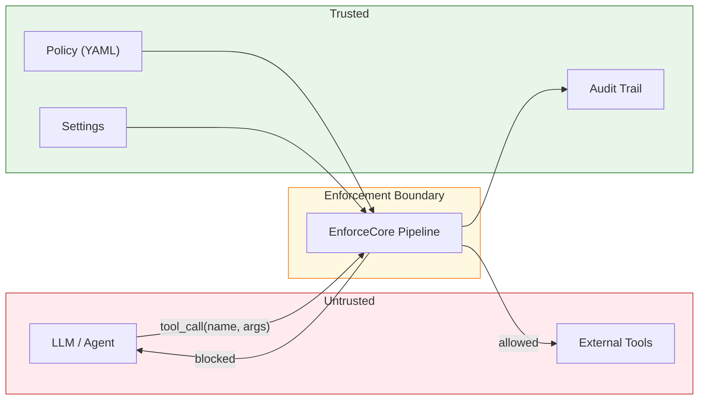

# EnforceCore — Formal Threat Model

**Version:** 1.9.0
**Last updated:** 2026-02-26
**Status:** Active — reviewed with each release

---

## 1. Purpose

This document defines the adversary model, trust boundaries, security
properties, assumptions, and known limitations of EnforceCore. It serves as
the reference for researchers evaluating the framework's security guarantees
and for operators assessing deployment risk.

---

## 2. System Model

EnforceCore is a **runtime enforcement layer** that sits between an AI agent
and the external tools it calls. Every tool invocation passes through an
enforcement pipeline before execution.

### Components in scope

| Component | Module | Role |
|---|---|---|
| Policy Engine | `enforcecore.core.policy` | Loads and evaluates declarative rules |
| Rule Engine | `enforcecore.core.rules` | Content-level pattern matching |
| Enforcer | `enforcecore.core.enforcer` | Pipeline coordinator |
| Redactor | `enforcecore.redactor` | PII and secret detection/removal |
| Auditor | `enforcecore.auditor` | Merkle-chained audit trail |
| Guard | `enforcecore.guard` | Cost, rate, and resource limits |
| Network | `enforcecore.guard.network` | Domain allow/deny enforcement |
| Hooks | `enforcecore.plugins.hooks` | Lifecycle extensibility |

---

## 3. Adversary Model

We consider four adversary types, ordered by increasing capability:

### 3.1 Adversary A1 — Compromised LLM Output

**Capability:** The adversary controls the LLM's output (via prompt injection,
jailbreak, or model compromise). The agent faithfully executes whatever the
LLM produces.

**Goal:** Execute unauthorized tool calls, exfiltrate data, escalate privileges.

**EnforceCore defense:**
- Tool allowlist/denylist blocks unauthorized tool names
  (`PolicyEngine.evaluate_pre()` in `enforcecore/core/policy.py`)
- Content rules block dangerous argument patterns (shell injection, SQL
  injection, path traversal) (`RuleEngine.check()` in `enforcecore/core/rules.py`)
- Domain enforcement blocks data exfiltration to unauthorized endpoints
  (`DomainChecker` in `enforcecore/guard/network.py`)
- Rate limiting prevents abuse-by-volume
  (`RateLimiter` in `enforcecore/guard/ratelimit.py`)
- PII/secret redaction strips sensitive data before tool execution
  (`Redactor` in `enforcecore/redactor/engine.py`)

**Evidence:**
- Test: `tests/core/test_enforcer.py::test_denied_tool_blocked`
- Test: `tests/core/test_rules.py::test_shell_injection_blocked`
- Test: `tests/guard/test_network.py::test_denied_domain_blocked`

### 3.2 Adversary A2 — Malicious Tool Response

**Capability:** The adversary controls a tool's output (compromised external
API, MITM, or intentionally malicious tool provider).

**Goal:** Inject sensitive data, prompt-inject the agent's next turn, leak
information via tool responses.

**EnforceCore defense:**
- Output redaction strips PII/secrets from tool responses before they return
  to the agent (`enforce_sync`/`enforce_async` post-call redaction)
- Output content rules block responses containing dangerous patterns
  (`RuleEngine.check()` applied to output strings)
- Output size limits prevent resource exhaustion
  (`PostCallResult.max_output_size_bytes` in `enforcecore/core/policy.py`)
- Audit trail records the response hash for forensic analysis

**Evidence:**
- Test: `tests/core/test_enforcer.py::test_output_redaction`
- Test: `tests/core/test_enforcer.py::test_output_size_limit`

### 3.3 Adversary A3 — Insider (Developer Disabling Enforcement)

**Capability:** The adversary has write access to the application code or
environment variables. They can modify settings, policies, or bypass the
`@enforce()` decorator entirely.

**Goal:** Disable enforcement for unauthorized actions, suppress audit entries,
weaken redaction.

**EnforceCore defense (limited):**
- `fail_open=True` emits `RuntimeWarning` when `ENFORCECORE_DEV_MODE` is not
  set (`enforcecore/core/hardening.py::warn_fail_open()`)
- Audit trail is append-only and Merkle-chained — retroactive tampering is
  detectable via `verify_trail()`
- Settings mutations are logged via structlog

**Limitations:**
- EnforceCore **cannot prevent** a developer from removing the `@enforce()`
  decorator. This is an inherent limitation of library-level enforcement.
- If an insider sets `ENFORCECORE_FAIL_OPEN=true` and `ENFORCECORE_DEV_MODE=1`,
  no warning is emitted and internal errors bypass enforcement.
- An insider with write access to the audit file can rebuild the entire Merkle
  chain (no asymmetric signature — see §5.3).

**Evidence:**
- Test: `tests/core/test_hardening.py::test_fail_open_default_false`
- Test: `tests/core/test_hardening.py::test_fail_open_warning`

### 3.4 Adversary A4 — Supply Chain (Compromised Dependency)

**Capability:** The adversary compromises one of EnforceCore's dependencies
or a transitive dependency.

**Goal:** Bypass enforcement, exfiltrate data via the dependency, inject
malicious behavior.

**EnforceCore defense:**
- **Minimal dependency surface** — 4 core runtime dependencies:
  - `pydantic>=2.5` (schema validation)
  - `pydantic-settings>=2.0` (env config)
  - `pyyaml>=6.0` (YAML parsing — `safe_load` only)
  - `structlog>=24.1` (structured logging)
- All optional extras (`presidio`, `opentelemetry`, `seccomp`, `typer`, `rich`)
  are isolated behind import guards and do not affect core enforcement.
- YAML is loaded with `yaml.safe_load()` — no arbitrary code execution.

**Limitations:**
- No runtime integrity checking of dependency code
- No SBOM (Software Bill of Materials) published yet — planned post-v1.0
- Pydantic is a large dependency with compiled extensions (pydantic-core in
  Rust) — compromise would be high-impact

---

## 4. Security Properties

We claim four formal security properties. Each is stated precisely,
accompanied by the code path that enforces it and the tests that verify it.

### Property S1 — Fail-Closed Completeness

> **Statement:** Every code path through the enforcement pipeline terminates
> in exactly one of: (a) ALLOW with result returned, or (b) BLOCK with
> `EnforcementViolation` raised.

**Implementation:**
- `enforce_sync()` and `enforce_async()` in `enforcecore/core/enforcer.py`
  wrap the entire pipeline in `try/except`.
- `EnforcementViolation` exceptions are **always re-raised**, regardless of
  `fail_open` setting.
- Non-violation `EnforceCoreError` exceptions are re-raised by default;
  only with `settings.fail_open=True` do they allow the call through.

**Caveat:** When `fail_open=True`, internal errors (not policy violations)
result in the call proceeding. This is documented and gated behind a
`RuntimeWarning` (suppressed only with `ENFORCECORE_DEV_MODE=1`).

**Tests:**
- `tests/core/test_hardening.py::test_fail_open_default_false`
- `tests/core/test_hardening.py::test_dev_mode_default_off`
- `tests/core/test_enforcer.py::test_denied_tool_blocked`

### Property S2 — Audit Completeness

> **Statement:** Every call that passes through `enforce_sync()` or
> `enforce_async()` produces exactly one audit entry, regardless of whether
> the call is allowed or blocked.

**Implementation:**
- Audit recording is the **last step** of the enforcement pipeline, in a
  `finally`-like position.
- Allowed calls record `decision="allowed"` with result hash.
- Blocked calls record `decision="blocked"` with `violation_type` and
  `violation_reason`.
- If audit recording itself fails and `fail_open=False`, the call is blocked
  (audit failure = enforcement failure).

**Tests:**
- `tests/core/test_enforcer.py::test_audit_entry_recorded`
- `tests/core/test_enforcer.py::test_audit_entry_on_block`
- `tests/core/test_enforcer.py::test_audit_multiple_calls`

### Property S3 — Chain Integrity

> **Statement:** Any modification to a recorded audit entry (edit, delete,
> insert, or reorder) is detectable by `verify_trail()`.

**Implementation:**
- Each `AuditEntry` includes a `merkle_hash` field: `SHA-256(canonical_json
  (entry_without_merkle_hash) || previous_merkle_hash)`.
- `verify_trail()` recomputes the hash chain and reports any discrepancy.
- Chain resumption: a new `Auditor` instance reads the last entry from an
  existing file to continue the chain.

**Caveat:** The chain is symmetric (SHA-256 only). Without additional
hardening, an attacker with write access to the audit file **can rebuild
the entire chain** from scratch. This means baseline chain integrity
protects against accidental corruption and third-party tampering, but not
against an attacker who controls both the audit file and the EnforceCore
process.

**Mitigations (v1.0.0b4+):**
- `Auditor(immutable=True)` — OS-enforced append-only prevents chain rebuild
  (see §5.3)
- `Auditor(witness=...)` — external hash witness detects chain rebuild even if
  the attacker has full filesystem control (see §5.3)

**Tests:**
- `tests/auditor/test_engine.py::test_chain_valid`
- `tests/auditor/test_engine.py::test_tamper_modify`
- `tests/auditor/test_engine.py::test_tamper_delete`
- `tests/auditor/test_engine.py::test_tamper_insert`
- `tests/auditor/test_engine.py::test_tamper_reorder`

### Property S4 — Redaction Totality

> **Statement:** For every string field in the tool call's arguments and
> return value, if the Redactor is enabled and the field matches a configured
> PII/secret pattern, the match is replaced before the tool executes
> (for inputs) or before the result is returned (for outputs).

**Implementation:**
- The Redactor uses compiled regex patterns for 5 PII categories and 11
  secret categories.
- Unicode normalization (`enforcecore/redactor/unicode.py`) strips invisible
  characters, normalizes homoglyphs, and decodes URL/HTML encoding before
  pattern matching.
- Recursive traversal handles nested dicts, lists, tuples, and sets.
- Overlap resolution keeps the longer match when patterns overlap.

**Caveats:**
- Regex-based detection has inherent false negatives. Novel PII formats,
  adversarial encoding beyond the normalized set, or PII embedded in
  structured formats (JSON-in-strings, base64) may evade detection.
- Person names are explicitly not supported (too noisy for regex).
- IPv6 addresses are not detected.
- Binary data and images are not scanned.

**Tests:**
- `tests/core/test_enforcer.py::test_input_redaction`
- `tests/core/test_enforcer.py::test_output_redaction`
- `tests/redactor/test_engine.py` (full pattern test suite)
- `tests/redactor/test_unicode.py` (evasion resistance)

---

## 5. Trust Boundaries

### 5.1 Policy Files

**Trust level:** TRUSTED — the operator controls policy content.

Whoever writes the policy YAML controls the enforcement behavior. A policy
with `on_violation: "log"` allows all calls through (logged but not blocked).
Policy files should be treated as security-critical configuration and
managed via version control with code review.

**Mitigations:**
- Schema validation via Pydantic rejects malformed policies
- `yaml.safe_load()` prevents code execution in YAML
- Policy composition (`extends:`) loads additional files via the same safe path

**Unmitigated risks:**
- No path jailing — `Policy.from_file()` resolves any filesystem path
- No signature verification on policy files

### 5.2 Environment Variables

**Trust level:** TRUSTED — the operator controls the deployment environment.

Security-critical settings controllable via environment:

| Variable | Risk if compromised |
|---|---|
| `ENFORCECORE_FAIL_OPEN=true` | Internal errors bypass enforcement |
| `ENFORCECORE_AUDIT_ENABLED=false` | Audit trail disabled |
| `ENFORCECORE_REDACTION_ENABLED=false` | PII/secrets pass through |
| `ENFORCECORE_DEV_MODE=1` | Suppresses fail-open warning |

### 5.3 Audit Trail Storage

**Trust level:** PARTIALLY TRUSTED — integrity is verifiable, with opt-in
OS-level enforcement and external witnessing.

The audit file is written as append-only JSONL with Merkle chain hashing.
`verify_trail()` detects any post-write modification. However, without
additional hardening, an attacker with filesystem access can rebuild the chain.

**Residual risks (without mitigations):**
- No encryption at rest — entries are plaintext JSON
- No asymmetric signature — an attacker with write access can rebuild the chain
- No external root-hash anchor — chain verification is self-referential

**Mitigation 1 — OS-enforced append-only (v1.0.0b4+):**

`Auditor(immutable=True)` sets the OS-level append-only attribute on the
audit file via `chattr +a` (Linux) or `chflags uappend` (macOS). This
prevents truncation, overwrite, or deletion — even by the file owner —
without first removing the attribute (which requires elevated privileges).

- **Linux:** Requires `CAP_LINUX_IMMUTABLE` (dropped by default in Docker;
  use `docker run --cap-add LINUX_IMMUTABLE`)
- **macOS:** Requires root or file owner on HFS+/APFS
- **Fail-safe:** If the platform does not support it, a warning is logged
  and the auditor continues without protection

See `enforcecore.auditor.immutable` for `platform_support_info()`.

**Mitigation 2 — Hash-only remote witness (v1.0.0b4+):**

`Auditor(witness=...)` publishes the hash of each audit entry to a
separate witness backend. Because the witness stores only hashes (~200
bytes per entry), the data overhead is negligible. If an attacker
rebuilds the Merkle chain, `verify_with_witness()` detects the mismatch.

Built-in witnesses:
- `CallbackWitness` — route hashes to any callable (queue, HTTP, database)
- `FileWitness` — append hashes to a separate JSONL file (different volume/user)
- `LogWitness` — emit hashes via Python `logging` (routes to syslog/journald)

This design was directly informed by guidance from Prof. Dan S. Wallach
(Rice University), co-author of Crosby & Wallach (2009).

See `enforcecore.auditor.witness` for `verify_with_witness()`.

### 5.4 Hook System

**Trust level:** UNTRUSTED CODE — hooks are user-provided callables.

Hooks registered via `HookRegistry` or `@on_pre_call` execute within the
enforcement pipeline. A malicious hook could:
- Modify call arguments (via context mutation)
- Suppress violations (by catching exceptions)
- Leak data (via side channels)

**Mitigations:**
- Hooks execute within the same process — they have no greater privilege
  than the application code itself
- Hook errors are caught and logged; they do not break the enforcement pipeline

### 5.5 Global Settings Singleton

**Trust level:** TRUSTED — but mutable at runtime.

`enforcecore.core.config.settings` is a module-level singleton. Any code that
can import it can mutate `settings.fail_open = True`. This is a trust boundary:
the enforcement guarantees assume the settings object is not adversarially
modified after initialization.

---

## 6. Assumptions

The following must hold for EnforceCore's security properties to apply:

1. **The `@enforce()` decorator is applied.** EnforceCore is a library, not
   an OS-level sandbox. If a developer does not decorate a tool function,
   it is not enforced. There is no mechanism to enforce "all calls must be
   decorated."

2. **Policy files are operator-controlled.** If an attacker can modify the
   policy YAML, they control enforcement behavior.

3. **Environment variables are operator-controlled.** If an attacker can set
   `ENFORCECORE_FAIL_OPEN=true`, internal errors bypass enforcement.

4. **The Python runtime is not compromised.** EnforceCore operates within
   CPython's execution model. A compromised interpreter, ctypes manipulation,
   or bytecode patching can bypass any Python-level enforcement.

5. **Dependencies are not compromised.** The 4 core dependencies (pydantic,
   pydantic-settings, pyyaml, structlog) are assumed to be trustworthy.

6. **The filesystem is not adversarially controlled.** Audit trail integrity
   assumes the attacker cannot freely write to the audit file. If they can,
   chain rebuild is possible (see §4 Property S3 caveat). **Partial mitigation
   (v1.0.0b4+):** ``Auditor(immutable=True)`` sets the OS-level append-only
   attribute, preventing truncation even with filesystem access (see §5.3).

---

## 7. Known Limitations

We explicitly document what EnforceCore does **not** protect against:

| Limitation | Explanation |
|---|---|
| **Decorator removal** | A developer can remove `@enforce()` — no enforcement |
| **In-process bypass** | Python code in the same process can call tools directly |
| **LLM content safety** | EnforceCore does not classify content as safe/unsafe — use NeMo Guardrails or LlamaGuard for that |
| **Binary/image PII** | Only text strings are scanned for PII |
| **Person name detection** | Too noisy for regex — not supported without NLP |
| **IPv6 detection** | Not included in PII patterns |
| **Asymmetric audit signing** | Merkle chain is symmetric — rebuild attack is possible. **Mitigated (v1.0.0b4+):** ``immutable=True`` prevents chain rebuild via OS-enforced append-only; ``witness=`` detects rebuild via hash comparison. See §5.3. |
| **Encryption at rest** | Audit entries are plaintext JSONL |
| **Multi-process enforcement** | Each process has its own Enforcer — no cross-process coordination. Pattern: use a shared audit file with a witness on a separate volume. |
| **Side-channel leaks** | Timing, error messages, and log content may leak information |
| **DNS-level enforcement** | Domain checking is syntactic (string matching), not DNS-resolved |

---

## 8. Revision History

| Version | Date | Changes |
|---|---|---|
| 1.0.0 | 2026-02-24 | Promoted to stable release; all properties verified by 147-point audit |
| 1.0.0b5 | 2026-02-23 | Updated §6 Assumption 6, §7 Limitations table, and §8 with b4 mitigation cross-references |
| 1.0.0b4 | 2026-02-23 | §5.3 rewritten: append-only files + hash-only witnesses; Property S3 caveat updated |
| 1.0.23a1 | 2026-02-23 | Updated version header to current release |
| 1.0.12a1 | 2026-02-21 | Initial formal threat model |
